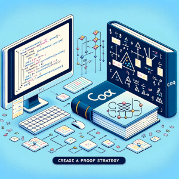

Our tool [coq-of-rust](https://github.com/formal-land/coq-of-rust) enables formal verification of [🦀&nbsp;Rust](https://www.rust-lang.org/) code, to make sure that a program has no bugs given a precise specification. We work by translating Rust programs to the general proof system [🐓&nbsp;Coq](https://coq.inria.fr/).

Here, we show how we formally verify an [ERC-20 smart contract](https://github.com/paritytech/ink/blob/master/integration-tests/erc20/lib.rs) written in Rust for the [Aleph Zero](https://alephzero.org/) blockchain. [ERC-20](https://en.wikipedia.org/wiki/Ethereum#ERC20) smart contracts are used to create new kind of tokens in an existing blockchain. Examples are stablecoins such as the [💲USDT](https://tether.to/).

:::tip Purchase

To formally verify your Rust codebase and improve the security of your application, email us at&nbsp;[&#099;&#111;&#110;&#116;&#097;&#099;&#116;&#064;formal&#046;&#108;&#097;&#110;&#100;](mailto:contact@formal.land)! Formal verification is the only way to prevent all bugs by exploring all possible executions of your program.

:::

<!-- truncate -->


## Smart contract code&nbsp;🦀

Here is the Rust code of the smart contract that we want to verify:

```rust
#[ink::contract]
mod erc20 {
    use ink::storage::Mapping;

    #[ink(storage)]
    #[derive(Default)]
    pub struct Erc20 {
        total_supply: Balance,
        balances: Mapping<AccountId, Balance>,
        allowances: Mapping<(AccountId, AccountId), Balance>,
    }

    #[ink(event)]
    pub struct Transfer {
        // ...
    }

    #[ink(event)]
    pub struct Approval {
        // ...
    }

    #[derive(Debug, PartialEq, Eq)]
    #[ink::scale_derive(Encode, Decode, TypeInfo)]
    pub enum Error {
        // ...
    }

    pub type Result<T> = core::result::Result<T, Error>;

    impl Erc20 {
        #[ink(constructor)]
        pub fn new(total_supply: Balance) -> Self {
            let mut balances = Mapping::default();
            let caller = Self::env().caller();
            balances.insert(caller, &total_supply);
            Self::env().emit_event(Transfer {
                from: None,
                to: Some(caller),
                value: total_supply,
            });
            Self {
                total_supply,
                balances,
                allowances: Default::default(),
            }
        }

        #[ink(message)]
        pub fn total_supply(&self) -> Balance {
            self.total_supply
        }

        #[ink(message)]
        pub fn balance_of(&self, owner: AccountId) -> Balance {
            self.balance_of_impl(&owner)
        }

        #[inline]
        fn balance_of_impl(&self, owner: &AccountId) -> Balance {
            self.balances.get(owner).unwrap_or_default()
        }

        #[ink(message)]
        pub fn allowance(&self, owner: AccountId, spender: AccountId) -> Balance {
            self.allowance_impl(&owner, &spender)
        }

        #[inline]
        fn allowance_impl(&self, owner: &AccountId, spender: &AccountId) -> Balance {
            self.allowances.get((owner, spender)).unwrap_or_default()
        }

        #[ink(message)]
        pub fn transfer(&mut self, to: AccountId, value: Balance) -> Result<()> {
            let from = self.env().caller();
            self.transfer_from_to(&from, &to, value)
        }

        #[ink(message)]
        pub fn approve(&mut self, spender: AccountId, value: Balance) -> Result<()> {
            let owner = self.env().caller();
            self.allowances.insert((&owner, &spender), &value);
            self.env().emit_event(Approval {
                owner,
                spender,
                value,
            });
            Ok(())
        }

        #[ink(message)]
        pub fn transfer_from(
            &mut self,
            from: AccountId,
            to: AccountId,
            value: Balance,
        ) -> Result<()> {
            let caller = self.env().caller();
            let allowance = self.allowance_impl(&from, &caller);
            if allowance < value {
                return Err(Error::InsufficientAllowance)
            }
            self.transfer_from_to(&from, &to, value)?;
            // We checked that allowance >= value
            #[allow(clippy::arithmetic_side_effects)]
            self.allowances
                .insert((&from, &caller), &(allowance - value));
            Ok(())
        }

        fn transfer_from_to(
            &mut self,
            from: &AccountId,
            to: &AccountId,
            value: Balance,
        ) -> Result<()> {
            let from_balance = self.balance_of_impl(from);
            if from_balance < value {
                return Err(Error::InsufficientBalance)
            }
            // We checked that from_balance >= value
            #[allow(clippy::arithmetic_side_effects)]
            self.balances.insert(from, &(from_balance - value));
            let to_balance = self.balance_of_impl(to);
            self.balances
                .insert(to, &(to_balance.checked_add(value).unwrap()));
            self.env().emit_event(Transfer {
                from: Some(*from),
                to: Some(*to),
                value,
            });
            Ok(())
        }
    }
}
```

This whole code is rather short, and contains no loops, what will simplify our verification process. It uses a lot of macros such as `#[ink(message)]` that are specific to the [ink!](https://use.ink/) language for smart contracts, built on top of Rust. To verify this smart contract, we removed all the macros and added a mock of the dependencies, such as `ink::storage::Mapping` to get a map data structure.

## The Coq translation&nbsp;🐓

By running our tool [coq-of-rust](https://github.com/formal-land/coq-of-rust) we automatically obtain the corresponding Coq code for the contract [erc20.v](https://github.com/formal-land/coq-of-rust/blob/main/CoqOfRust/examples/default/examples/ink_contracts/erc20.v). Here is an extract for the `transfer` function:

```coq
(*
    fn transfer(&mut self, to: AccountId, value: Balance) -> Result<()> {
        let from = self.env().caller();
        self.transfer_from_to(&from, &to, value)
    }
*)
Definition transfer
    (self : mut_ref ltac:(Self))
    (to : erc20.AccountId.t)
    (value : ltac:(erc20.Balance))
    : M ltac:(erc20.Result unit) :=
  let* self : M.Val (mut_ref ltac:(Self)) := M.alloc self in
  let* to : M.Val erc20.AccountId.t := M.alloc to in
  let* value : M.Val ltac:(erc20.Balance) := M.alloc value in
  let* from : M.Val erc20.AccountId.t :=
    let* α0 : mut_ref erc20.Erc20.t := M.read self in
    let* α1 : erc20.Env.t :=
      M.call (erc20.Erc20.t::["env"] (borrow (deref α0))) in
    let* α2 : M.Val erc20.Env.t := M.alloc α1 in
    let* α3 : erc20.AccountId.t :=
      M.call (erc20.Env.t::["caller"] (borrow α2)) in
    M.alloc α3 in
  let* α0 : mut_ref erc20.Erc20.t := M.read self in
  let* α1 : u128.t := M.read value in
  let* α2 : core.result.Result.t unit erc20.Error.t :=
    M.call
      (erc20.Erc20.t::["transfer_from_to"] α0 (borrow from) (borrow to) α1) in
  let* α0 : M.Val (core.result.Result.t unit erc20.Error.t) := M.alloc α2 in
  M.read α0.
```

More details of the translation are given in previous blog posts, but basically:

- we make explicit all memory and implicit operations (like borrowing and dereferencing),
- we apply a monadic translation to chain the primitive operations with `let*`.

## Proof strategy



We verify the code in two steps:

1. Show that all the smart contract code can be simulated by a simpler, and purely functional, Coq code.
2. Show that the simulation is correct.

That way we can get rid once and for all of all the memory-related operations by showing the equivalence with a simulation. Then, we can focus on the functional code, which is simpler to reason about. We can cite another project, [Aeneas](https://github.com/AeneasVerif/aeneas), which proposes to do the first step (removing memory operations) automatically.

## Conclusion

We have illustrated in an example how we translate a simple function from Rust to Coq. In this example, we saw how the pointer operations are made explicit in the abstract syntax tree of Rust, and how we simplify them for the frequent cases.

If you have any comments or suggestions, feel free to email us at&nbsp;[&#099;&#111;&#110;&#116;&#097;&#099;&#116;&#064;formal&#046;&#108;&#097;&#110;&#100;](mailto:contact@formal.land). In future posts, we will go into more detail about the verification process itself.
