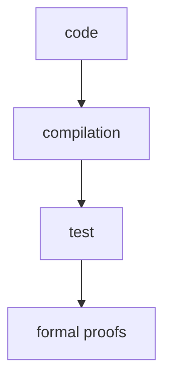

# 🏁 Introduction

Here we present our project.

## Technology

We formally verify programs by automatically translating the source code to the&nbsp;<a href="https://coq.inria.fr/">Coq</a> proof system. We then prove arbitrarily complex properties, either automatically or manually. We plug into continuous integration systems to make sure proofs are kept up-to-date with the code.

Our technology is used by the crypto-currency <a href="https://tezos.com/">Tezos</a> to formally verify its implementation. We believe Tezos to be the first crypto-currency with a process of formal verification of its implementation, making it one the safest decentralized platform. See the <a href="https://nomadic-labs.gitlab.io/coq-tezos-of-ocaml/">Coq Tezos of OCaml</a> project for the current status.

Besides the layers of type-checking and testing, we propose to add formal verification as a final layer of security for software development:


<!-- Diagram generated on https://shaky.github.bushong.net/ ; see the file programming-flow.txt for the source -->



## Our proposal

Our proposal is to formally verify critical parts of existing projects. We support code written in <a href="https://www.rust-lang.org/">Rust</a>, <a href="https://www.python.org/">Python</a>, or <a href="https://ocaml.org/">OCaml</a> languages.

## Get started

Contact us at <code><a href="mailto:mailto:&#099;&#111;&#110;&#116;&#097;&#099;&#116;&#064;formal&#046;&#108;&#097;&#110;&#100;">&#099;&#111;&#110;&#116;&#097;&#099;&#116;&#064;formal&#046;&#108;&#097;&#110;&#100;</a></code> for an evaluation of your code and discuss what is possible to do.

```

```
